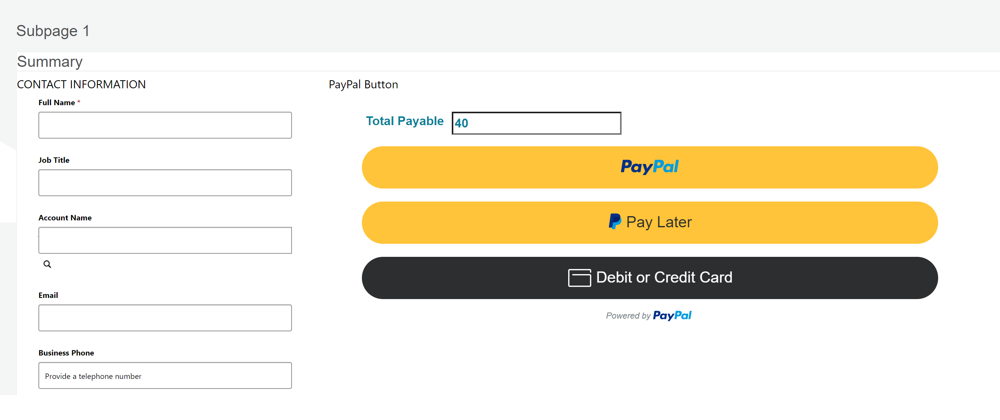
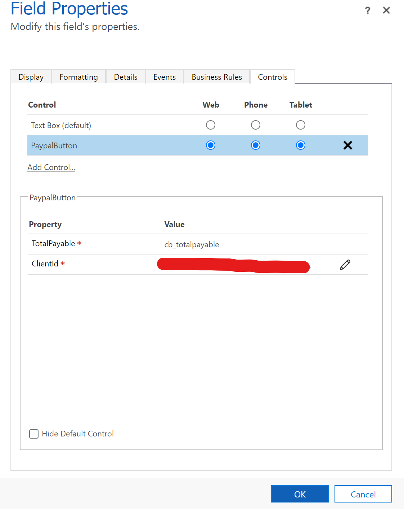

# Codebug PayPal Button
Simple Power App Component Framework control for PayPal integration to collect payment through PayPal in Dataverse. This control can work in canvas app and power app portal self-service scenarios to collect payment via paypal. 

### Configuration
* TotalPayable - (number (decimal) - required and bound) - This is the total amount due in any currency. If (in portal apps) the bound form control does not appear the control will its own field for the total payable value.
* ClientId - (string - required) - ApiKey that will let this control access to PayPal service. for more information how to set up this client id please visit [PayPal Documentation](https://developer.paypal.com/docs/api-basics/manage-apps/).

> **Note**
> Currently the currency defaults to browser's local. Meaning the control does not pick up the currency value from the Dataverse Org settings. I plan to update this functionality in later releases.
